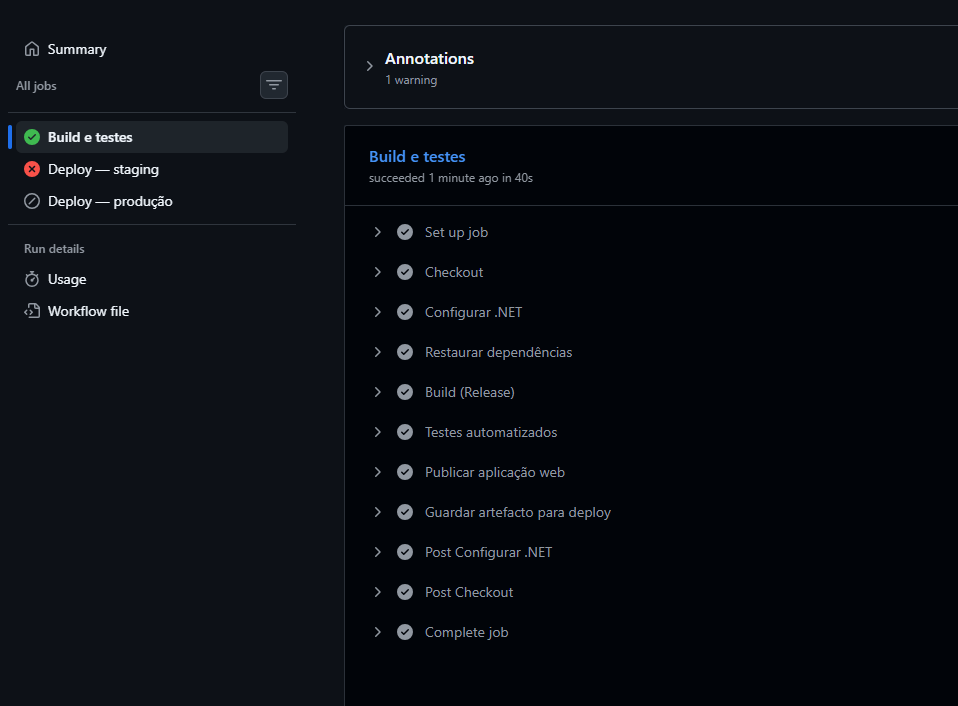

# Projeto - Cidades ESGInteligentes

API REST para monitoramento e otimização de consumo energético, alinhada a indicadores de sustentabilidade (**ESG**). Desenvolvida em **.NET 8** como backend do ecossistema *Cidades Inteligentes*, com autenticação JWT, persistência em **Oracle** (ambiente acadêmico) e documentação OpenAPI (Swagger).

---

## Como executar localmente com Docker

**Pré-requisitos:** [Docker Desktop](https://www.docker.com/products/docker-desktop/) (ou Docker Engine + Docker Compose) e acesso à rede onde o Oracle FIAP estiver acessível (se usar a mesma base que em produção acadêmica).

1. **Clone o repositório** e entre na pasta do **projeto Web** (onde estão o `Dockerfile` e o `docker-compose.yml` — pasta `EnergyMonitoringAPI` dentro da raiz do repositório):

   ```bash
   git clone <url-do-repositorio>
   cd <nome-da-pasta-do-clone>        # raiz do repositório (contém o .sln)
   cd EnergyMonitoringAPI              # projeto da API
   ```

2. **(Recomendado)** Ajuste variáveis sensíveis: edite o `docker-compose.yml` ou crie um arquivo `.env` e aponte para ele no `docker-compose.yml`, em vez de commitar senhas. As variáveis seguem o padrão ASP.NET Core (`ConnectionStrings__DefaultConnection`, `JwtSettings__SecretKey`, etc.).

3. **Construa e suba o contêiner:**

   ```bash
   docker compose up --build
   ```

   Na primeira execução o Docker utiliza o `Dockerfile` para gerar a imagem e expõe a API na porta **5066** (HTTP mapeado para a porta 80 do contêiner), conforme definido no compose.

4. **Verifique a API:** abra o Swagger em `http://localhost:5066/swagger` (em `Development` o pipeline HTTP está configurado para servir Swagger).

5. **Parar os contêineres:**

   ```bash
   docker compose down
   ```

> **Nota:** O `docker-compose.yml` do repositório define a rede `energy-network` e publica as portas `5066:80` e `7066:443`. Para HTTPS local com certificados de desenvolvimento, pode ser necessário configuração adicional no Kestrel; o fluxo mais simples para testes é HTTP na porta mapeada.

---

## Pipeline CI/CD

### Ferramentas utilizadas

| Ferramenta | Papel |
|------------|--------|
| **GitHub Actions** | Orquestração do pipeline na cloud, integrada ao repositório GitHub. |
| **.NET SDK 8** | Restauração, compilação, testes e publicação da aplicação. |
| **Azure Web Apps** | Destino do deploy automatizado (ambientes de **staging** e **produção**). |
| **azure/webapps-deploy** | Ação oficial que envia o pacote publicado para o App Service (perfil de publicação). |
| **GitHub Environments** | Segregação de secrets e regras (ex.: aprovadores) por ambiente. |

### Etapas e funcionamento

O fluxo está definido em [`.github/workflows/ci-cd.yml`](../.github/workflows/ci-cd.yml) na raiz da solução.



1. **Gatilhos:** `push` e *pull request* na branch `main`, e execução manual (`workflow_dispatch`). Execuções concorrentes na mesma ref cancelam a anterior (`concurrency`), evitando deploys duplicados.

2. **Job *Build e testes* (`build-and-test`):**
   - *Checkout* do código.
   - Instalação do .NET 8 (`actions/setup-dotnet`).
   - `dotnet restore` e `dotnet build` da solução `EnergyMonitoringAPI.sln` em **Release**.
   - `dotnet test` — executa a bateria de testes **xUnit** existente (integração via `WebApplicationFactory` com base **in-memory** no projeto de testes, para estabilidade na CI sem depender do Oracle a partir dos runners públicos).
   - Em **push** para `main`: `dotnet publish` do projeto web e upload do artefato `webapp-publish` para uso nos deploys.

3. **Job *Deploy — staging* (`deploy-staging`):** só após sucesso do build/testes e só em **push** para `main`. Usa o ambiente GitHub **`staging`**, transfere o artefato e executa o deploy no App Service de staging (secrets `AZURE_WEBAPP_NAME` e `AZURE_WEBAPP_PUBLISH_PROFILE` configurados nesse ambiente).

4. **Job *Deploy — produção* (`deploy-production`):** executa em cadeia **após** o staging com sucesso. Usa o ambiente **`production`** e credenciais próprias (normalmente outro App Service ou outro perfil). Assim garante **dois ambientes distintos** e ordem **staging → produção**.

**Pull requests:** apenas build e testes — **não** há deploy, o que protege produção de código não integrado.

**Configuração necessária no GitHub:** *Settings → Environments* — criar `staging` e `production` e definir em cada um os secrets acima (conteúdo completo do arquivo `.PublishSettings` exportado do Azure Portal).

---

## Containerização

### Conteúdo do `Dockerfile`

```dockerfile
# Build stage
FROM mcr.microsoft.com/dotnet/sdk:8.0 AS build
WORKDIR /src

# Copiar arquivos de projeto
COPY ["EnergyMonitoringAPI.csproj", "./"]
RUN dotnet restore "EnergyMonitoringAPI.csproj"

# Copiar todo o código
COPY . .

# Build da aplicação
RUN dotnet build "EnergyMonitoringAPI.csproj" -c Release -o /app/build

# Publish
FROM build AS publish
RUN dotnet publish "EnergyMonitoringAPI.csproj" -c Release -o /app/publish

# Runtime stage
FROM mcr.microsoft.com/dotnet/aspnet:8.0 AS final
WORKDIR /app
EXPOSE 80
EXPOSE 443

# Copiar arquivos publicados
COPY --from=publish /app/publish .

# Definir entrypoint
ENTRYPOINT ["dotnet", "EnergyMonitoringAPI.dll"]
```

### Estratégias adotadas

- **Multi-stage build:** estágios separados para **SDK** (restore, build, publish) e **ASP.NET runtime** final, reduzindo o tamanho da imagem e evitando expor ferramentas de compilação em produção.
- **Cache de dependências:** cópia primeiro do `.csproj` e `dotnet restore` antes do restante código, maximizando cache de camadas quando só o código-fonte muda.
- **Imagem oficial Microsoft:** `mcr.microsoft.com/dotnet/sdk:8.0` e `aspnet:8.0` para suporte LTS e paridade de versão com o projeto.
- **Publicação Release:** binários otimizados para execução no contêiner.
- **Orquestração local:** `docker-compose.yml` define o serviço `api`, *build* com contexto na pasta da API, mapeamento de portas e variáveis de ambiente para connection string e JWT.

---

## Prints do funcionamento

Inclua aqui evidências do trabalho (substitua os itens por imagens ou links reais).

| Evidência | Descrição | Onde colocar |
|-----------|-----------|----------------|
| Execução local | Swagger ou chamada HTTP com a API em execução (Docker ou `dotnet run`). | Captura de tela ou link `http://localhost:5066/swagger` |
| Pipeline CI/CD | Execução bem-sucedida no GitHub Actions (jobs *Build e testes*, *Deploy staging*, *Deploy produção*). | Link para a execução: `https://github.com/<org>/<repo>/actions` |
| Staging | App Service de staging respondendo (ex.: health check ou Swagger, se ativo). | URL do Azure + captura de tela |
| Produção | App Service de produção respondendo após o pipeline. | URL do Azure + captura de tela |

> **Dica:** no repositório Git pode guardar imagens em `docs/imagens/` e referenciá-las em Markdown, por exemplo ``.

---

## Tecnologias utilizadas

### Backend e dados

- **C# / .NET 8** (ASP.NET Core Web API)
- **Entity Framework Core 8** (Oracle + provider Oracle EF Core; testes com provider **InMemory**)
- **Oracle Database** (FIAP — ambiente acadêmico)
- **JWT Bearer** (`Microsoft.AspNetCore.Authentication.JwtBearer`)
- **BCrypt.Net-Next** (hash de senhas)

### API e documentação

- **Swagger / OpenAPI** (`Swashbuckle.AspNetCore`)

### Qualidade e CI/CD

- **xUnit** + **Microsoft.AspNetCore.Mvc.Testing**
- **GitHub Actions** (workflow CI/CD)
- **Azure App Service** (deploy staging e produção)
- **Docker** + **Docker Compose** (containerização local)

### Padrões

- **Repository pattern**, **injeção de dependências**, **DTOs / ViewModels**

---

## Documentação adicional da API

### Estrutura do repositório (solução)

```text
EnergyMonitoringAPI/
├── EnergyMonitoringAPI/          # Projeto Web API
├── EnergyMonitoringAPI.Tests/    # Testes automatizados
├── EnergyMonitoringAPI.sln
└── .github/workflows/ci-cd.yml   # Pipeline CI/CD
```

### Endpoints principais (resumo)

| Área | Método | Rota | Autenticação |
|------|--------|------|----------------|
| Auth | POST | `/api/Auth/register` | Não |
| Auth | POST | `/api/Auth/login` | Não |
| Leituras | GET | `/api/EnergyReadings` | JWT |
| Leituras | POST | `/api/EnergyReadings` | JWT |
| Analytics | GET | `/api/Analytics/consumption` | JWT |

Detalhes de corpos de pedido e query strings: ver **Swagger** em desenvolvimento ou a coleção em `Postman/`.

### Executar sem Docker (SDK local)

Na **raiz do repositório** (onde está o `EnergyMonitoringAPI.sln`):

```bash
dotnet restore EnergyMonitoringAPI.sln
dotnet run --project EnergyMonitoringAPI/EnergyMonitoringAPI.csproj
```

Configure `appsettings.json` / `appsettings.Development.json` ou *user secrets* com a connection string Oracle e as chaves JWT.

### Testes

Na raiz do repositório:

```bash
dotnet test EnergyMonitoringAPI.sln -c Release
```

---

## Autores e licença

**Isra Medeiros** · RM 560139 · Ciência da Computação — FIAP  

Projeto acadêmico — FIAP.
